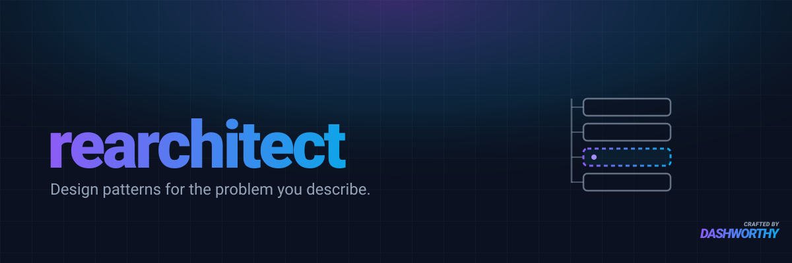

# rearchitect

A Claude Code plugin that turns a **described architectural problem** into **up to three applicable
design patterns**, each with an **interface sketch** of the refactor it would produce — then a
recommendation.

You describe code that's painful to change, extend, test, or reason about. `rearchitect` diagnoses
the smell against SOLID and a smell catalog, names only the Gang-of-Four patterns whose triggers
genuinely fire, sketches what each refactor's boundary would look like in your language, and
recommends one — with "leave it as it is" always on the table.

It proposes options to accept or reject. It does **not** implement the refactor, audit your whole
codebase, or force a pattern where none fits.

## What it produces

```
## Problem (as a cost)      — what change is hard, stated concretely
## Diagnosis                — the lenses that fired (SOLID, smells, leaks, depth)
## Candidates (up to 3)     — each: pattern, interface sketch, what it buys / costs
## Recommendation           — the one to reach for, with the plain shape on the table
```

## When it triggers

Phrasings like: "this class is doing too much", "every new type means editing five files", "I keep
copy-pasting this sequence", "how should I restructure this", "what pattern fits here", "this is hard
to test/extend/change".

## Structure

```
rearchitect/
├── .claude-plugin/                 — Claude Code plugin manifest
│   ├── plugin.json
│   └── marketplace.json
├── .codex-plugin/                  — OpenAI Codex plugin manifest
│   └── plugin.json
├── skills/rearchitect/             — canonical skill (shared by both hosts)
│   ├── SKILL.md
│   └── references/
│       ├── pattern-matrix.md       — 23 GoF patterns, one trigger each
│       ├── diagnostic-lenses.md    — SOLID, smell→remedy, leakage tests, depth
│       └── interface-sketches.md   — how to sketch a refactor's boundary
├── .agents/skills/rearchitect      — Codex discovery symlink → skills/rearchitect
└── evals/                          — skill-creator eval set (35 cases, 6 assertions each)
```

## License

[MIT](LICENSE.md)
